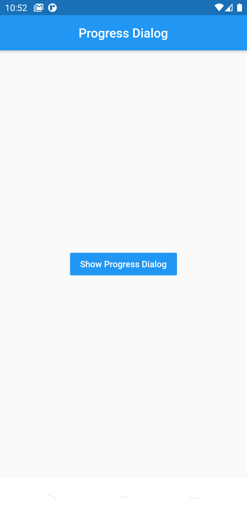

# progress_dialog

Helps developers improve user-experience using a progress indicator and a loading message.

### Example



## Getting Started
 ### Install
Add dependency to pubspec.yaml file :
`progress_dialog: 0.0.1`

Run this command :
`$ flutter pub get`

### Import
Import class in your project :
`import 'package:progress_dialog/progress_dialog.dart';`

### Show progress dialog :

```
ProgressDialog progressDialog = ProgressDialog(
                  context: context,
                  backgroundColor: Colors.blue,
                );

	progressDialog.show(); // show dialog
	progressDialog.dismiss(); //close dialog
```
